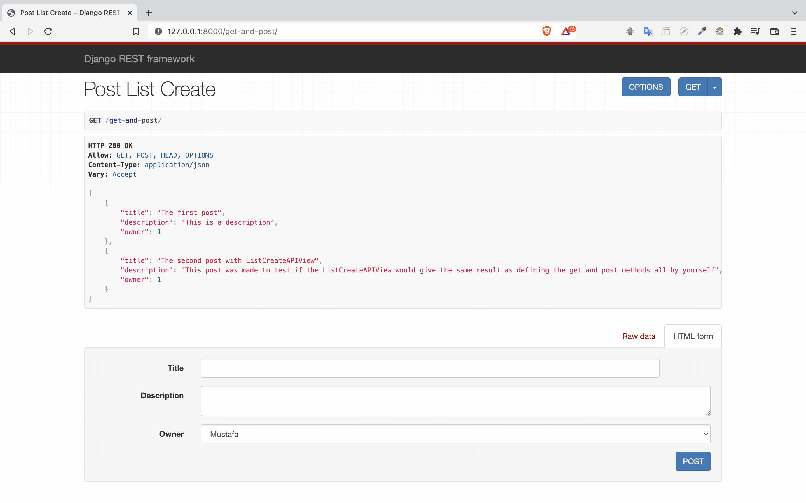

<h1 align="center">Django Rest Framework - Tutorial-2</h1>

## Table of Contents

- [Overview](#overview)
- [Stack & Tools](#stack)
- [How to use](#how-to-use)

## Overview

This is my second attempt to create an api. With this tutorial, I saw the difference between the built-in api handling with Django and the 3rd party DRF way. I learned about the generic DRF views and saw how relatively easy it is to use compared to function based api handling.



<h2 id="stack">Stack & Tools</h2>

- Django
- DRF (Drango Rest Framework)
- Postman

## How To Use

```
# Clone this repository
$ git clone https://github.com/MSKose/drf-tutorial-2.git

# Install dependencies
    $ python -m venv env
    > env/Scripts/activate (for win OS)
    $ source env/bin/activate (for macOs/linux OS)
    $ pip install -r requirements.txt

# Add .env file
    add your SECRET_KEY in a .env file

# Run the app
    $ python manage.py runserver
```

## Acknowledgements
- Tutorial source: [JustDjango](https://www.youtube.com/watch?v=RPsDhoWY_kc&list=PLLRM7ROnmA9HzbIXYN6D3wOZ0wUrqNs_d&index=1)